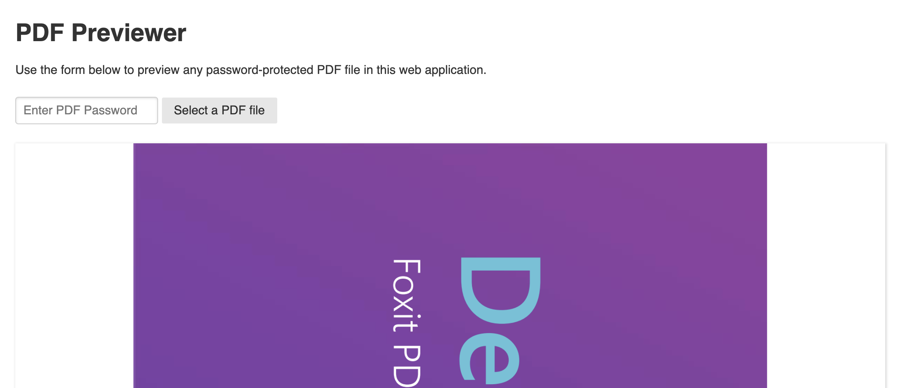

# Previewing Password-Protected PDFs

This Node application demonstrates using the [Foxit PDF SDK for Web](https://developers.foxitsoftware.com/pdf-sdk/web/) to open password-protected PDFs in a web application.

## Prerequisites
- Foxit SDK license key and serial number
- The PDF SDK for Web downloaded on your machine
- NPM and Node (version 8+)

## Setup
- Clone this repository
- Install dependencies: `npm i`
- Copy the `.env.example` file to `.env` and add your Foxit License serial number and key.
- Copy the `lib/` directory from the Foxit PDF SDK for Web into this app's `public/` directory.
- Run the local server: `npm start`
- Visit [localhost:3000/](http://localhost:3000/) and open a password-protected PDF.

